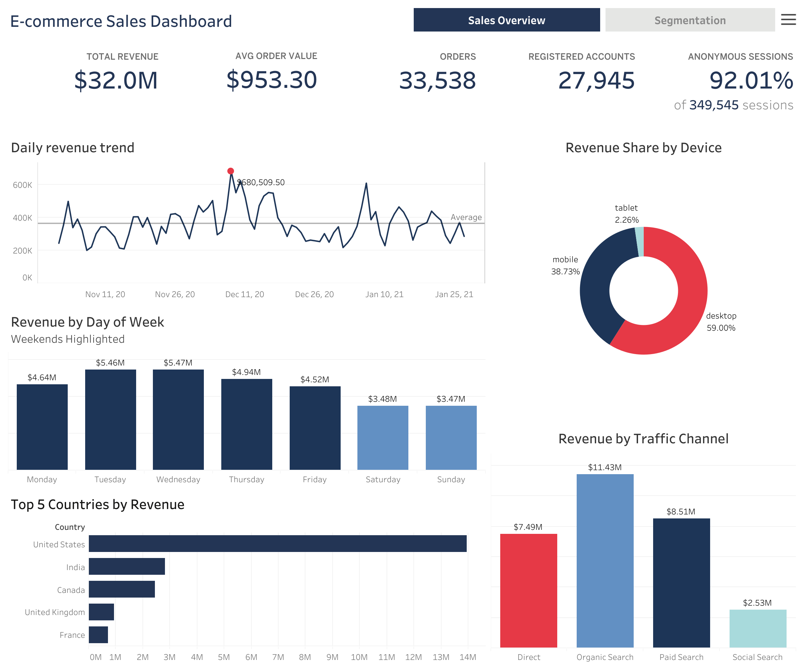
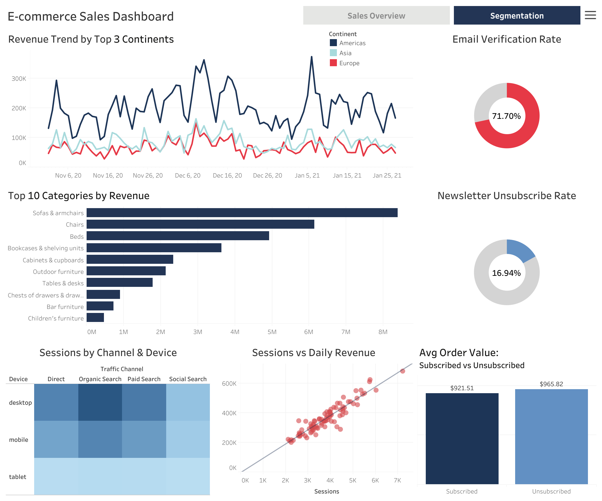

# E-commerce Sales Analysis | Portfolio Project

> **End-to-end data analysis** of an online furniture store — from SQL data extraction in Google BigQuery to statistical testing in Python and an interactive Tableau dashboard.

---

## Live Dashboard

**[View on Tableau Public →](https://public.tableau.com/views/E-commerceDashboard_17817134733990/E-commerceSalesDashboard)**

| Sales Overview | Segmentation Analysis |
|---|---|
| KPIs · Revenue trend · Top countries · Device & channel breakdown | Product categories · Continent trends · User behaviour · Correlation |

---

## Project Goals

- Extract and prepare data from a multi-table relational database using **SQL in BigQuery**
- Perform **exploratory data analysis** (EDA) across 230k+ sessions
- Analyze **sales dynamics**, **traffic channels**, **device types**, and **user segments**
- Apply **statistical methods** to validate business hypotheses
- Build an **interactive Tableau dashboard** for stakeholder presentation

---

## Dataset

Data was extracted from **Google BigQuery** (`data-analytics-mate.DA` dataset) via a custom SQL query joining 5 tables:

| Table | Description |
|---|---|
| `session` | All site sessions with dates |
| `session_params` | Device, browser, OS, traffic source & channel |
| `account` / `account_session` | Registered user data |
| `order` / `product` | Purchase and product details |

**Dataset overview:**
- Period: November 2020 – January 2021
- ~230,000 rows · 18 columns
- ~9.6% conversion rate (sessions with purchases)
- 92% anonymous sessions

---

## Analysis Structure

### 1. Data Loading & Cleaning
- BigQuery connection via `google-cloud-bigquery`
- LEFT JOINs to preserve all sessions including anonymous users
- Missing value analysis with business justification
- Data type validation and deduplication

### 2. Sales Analysis
- Top-3 continents & Top-5 countries by revenue and order count
- Top-10 product categories globally vs. leading market (US)
- Revenue breakdown by device type and traffic source (% of total)
- Registered user metrics: email verification rate, unsubscribe rate, behavioural comparison

### 3. Sales Dynamics
- Daily revenue trend with peak annotation
- Seasonality analysis by day of week
- Multi-line trends by continent, traffic channel, device, and product category

### 4. Pivot Tables
- Sessions: Traffic Channel × Device
- Revenue: Top-10 Categories × Top-5 Countries
- AOV: Continent × Device
- Revenue: Weekday × Traffic Channel

### 5. Correlation Analysis
- Sessions vs. Revenue (Spearman + normality test)
- Cross-continent revenue correlations (pairwise, Bonferroni-corrected)
- Cross-channel and cross-category revenue correlations
- Correlation heatmaps for all groups

### 6. Statistical Hypothesis Testing

| Test | Question | P-value | Result |
|---|---|---|---|
| Mann-Whitney U | Registered vs. anonymous — daily revenue | 0.0000 | ✓ Significant |
| Kruskal-Wallis + Dunn post-hoc | Sessions across traffic channels | 0.0000 | ✓ Significant |
| Z-test (proportions) | Organic share: Europe vs. Americas | 0.7722 | ✗ Not significant |
| Z-test (proportions) | Conversion rate: Desktop vs. Mobile | 0.4103 | ✗ Not significant |
| Chi-square | Device type vs. Traffic channel independence | 0.7851 | ✗ Not significant |

---

## Tech Stack

| Tool | Usage |
|---|---|
| **Python 3.10** | Core analysis language |
| **pandas / NumPy** | Data manipulation |
| **Matplotlib / Seaborn** | Visualizations (18+ charts) |
| **SciPy / statsmodels** | Statistical testing |
| **Google BigQuery** | Data source (SQL) |
| **Google Colab** | Development environment |
| **Tableau Public** | Interactive dashboard |

---

## Key Findings

- **Desktop dominates revenue** (59%) despite global "Mobile First" trends — consistent with furniture e-commerce where customers prefer large screens for detailed product inspection
- **Organic Search is the top revenue channel** (34%), indicating strong SEO performance and brand presence
- **The US market mirrors global category trends** — the same top-5 categories rank identically, making US data representative for global strategy decisions
- **Registered users generate statistically significantly higher daily revenue** than anonymous users (Mann-Whitney U, p < 0.05), highlighting the value of account registration incentives
- **Strong positive correlation** between daily session count and revenue (Spearman r ≈ 0.87), confirming that traffic growth consistently translates to revenue growth

---

## Author

**Olha Klochnyk ** — Data Analyst  
